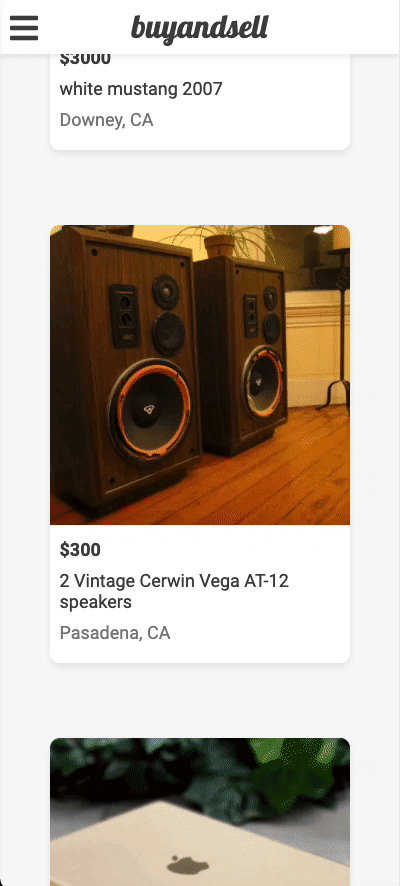

# buyandsell

A full stack web application for buyers and sellers to fulfill their needs in a simple yet intuitive marketplace.

My goal in building this project was to create something that was first and foremost useful and easy to use. The main philosophy throughout the process, in both a design and functionality standpoint, was to give the user a minimalist UI for conveniently selling and buying items in an overall smooth experience.

## Live Demo

Try the application live at [buyandsell-app.herokuapp.com](https://buyandsell-app.herokuapp.com).


## Preview

<p align="center">
  
&nbsp; &nbsp; &nbsp; &nbsp;
  
</p>

## Technologies Used

- React
- PostgreSQL
- Node.js
- Express.js
- Webpack
- Babel
- JavaScript
- HTML5
- CSS3
- AWS S3
- Google Maps APIs (Geocoding, Maps, Places)
- SendGrid
- Heroku

## Features

- User can create a listing
- User can view all listings
- User can save a listing
- User can send a message to a seller
- User can edit their listing
- User can sign up
- User can sign in

## Development

- User can filter by location
- User can toggle between light and dark mode

## System Requirements

- Node.js 10 or higher
- NPM 6 or higher

## Getting Started

1. Clone the repository.

    ```shell
    git clone git@github.com:kennydpark/buyandsell.git
    cd buyandsell
    ```

2. Install all dependencies using `npm`.

    ```shell
    npm install
    ```

3. Create a copy of `.env.example`.

    ```shell
    cp .env.example .env
    ```

4. Start postgreSQL.

    ```shell
    sudo service postgresql start
    ```

5. Create a new database.

    ```shell
    createdb <YOUR APP NAME>
    ```

6. Import the example database.

    ```shell
    npm run db:import
    ```

7. Start the database (optional - if pgweb is installed).

    ```shell
    pgweb --db=<YOUR APP NAME>
    ```

8. Create an S3 bucket, Google Maps API, and SendGrid API. Change the key values in `.env`.

    ```shell
    AWS_ACCESS_KEY_ID=changeMe
    AWS_SECRET_ACCESS_KEY=changeMe
    AWS_S3_BUCKET=some-bucket-name
    GOOGLE_API_KEY=changeMe
    SENDGRID_API_KEY=changeMe
    ```

9. Start the project. Once started, you can view the application by opening http://localhost:3000 in your browser.

    ```shell
    npm run dev
    ```
